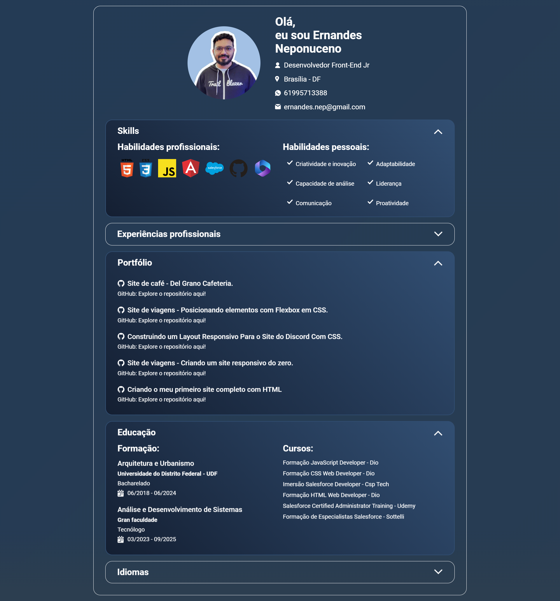

## 🏋️‍♂️ Desafio de Projeto HTML + CSS + JavaScript: Criando uma Página de Portfólio Profissional.

Desafio de projeto proposto para criação de uma página de portfólio profissional com CSS e JavaScript.   
Os temas abordados são: 

- Requisições Assíncronas (Async/Await). 
- Manipulação do DOM.
- Conceitos de mobile first.
- Utilização e funcionamento de API´s.
- Renderização dinâmica com template literals.
- Uso de Map e Join.
- Responsividade. 

Além de outros recursos.

## 💻 Tecnologias utilizadas nesse projeto:

  
  
  

## 💻 Preview:
- Veja como ficou o projeto: [GitHub Pages](https://ernandesneponuceno.github.io/js-developer-portfolio/)
  

## 🤔 O que aprendi com esse projeto:

- Aprimorar minhas habilidades em HTML, CSS e JavaScript.
- Requisições Assíncronas (Async/Await). 
- Utilizar uma API.
- Construção de uma function para manipulação do HTML. 
- Conceitos de mobile first e melhora na utilização de media queries.
- Utilizar os recursos de responsividade.

## 📌 Créditos
- **Curso:** ✨ Criando e Estilizando uma Página de Portfólio Profissional com CSS e JavaScript, no seguinte endereço:
  [Formação JavaScript Developer](https://web.dio.me/track/formacao-javascript-developer)
  
- **Design:** Template do figma -  no seguinte endereço:
  [Portfolio](https://www.figma.com/file/g6zA6klLrCWZAp76tzoVJZ/Portfolio---EDUCATION?type=design&node-id=0-1&mode=design&t=HRSkvMBvSktDAqq0-0)
  
